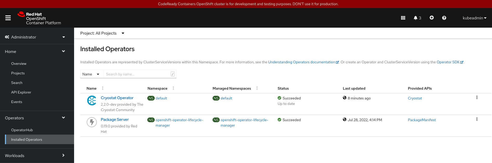

# Things to know about cryostat operator

Here are some useful things to know if you are working on https://github.com/cryostatio/cryostat-operator.

## Prerequisites

### Hardware 
Minimum hardware requirements to run crc instance ([reference](https://crc.dev/crc/#minimum-system-requirements-hardware_gsg)):
- 4 physical CPU cores
- 9 GB of free memory
- 35 GB of storage space

**Note**: Some workload might require more resources, for examples, enabling cluster monitoring.

### Dependencies

CRC requires the `libvirt` and `NetworkManager` packages to run on Linux. On Fedora, you will likely need to:
```bash
sudo dnf install NetworkManager
```

A [Quay.io](quay.io) account is needed to be able to pull, push, and store container images. Red Hat associates should be able to create an account and sign in with their Red Hat email. Details can be followed [here](https://access.redhat.com/articles/5363231).

In order to pull images from the Quay.io repository, Podman needs to be signed in from a Quay account. More details about [podman-login](https://docs.podman.io/en/latest/markdown/podman-login.1.html).

```bash
$ podman login quay.io
Username: # type in your quay.io username (e.g. macao)
Password: # type in your quay.io password (e.g. myquayiopassword)
```
When successful:
```bash
Login Succeeded!
```

## Setup/Start CodeReady Container

Downloaded `crc` binary from [Openshift console](https://console.redhat.com/openshift/create/local) (**recommended**) or build from [source](https://github.com/code-ready/crc). Once downloaded/built, add it to `PATH`:

```bash
sudo install -o root -g root -m 0755 /path/to/crc /usr/local/bin/crc # This add crc to /usr/local/bin
```

Set up environment:

```bash
crc setup
```

Start a cluster instance:

```bash
crc start
```


**Note**: To enable cluster monitoring, run (before starting or after stopping instance):

```bash
crc config set enable-cluster-monitoring true
```

Then, start the instance again. Mostly likely, you will need to run `crc` with more RAM (default 9GB).

```bash
crc start -m 14336 # 14GiB (recommended for core functionality)
```

## Deployment

There are 2 ways to deploy the operator to the k8s/openshift cluster.

1. Manual deployment with `make deploy`. This way you can test our your changes to configuration files (i.e. `*.yaml`) with `crc`.
2. Bundle deployment with `make deploy_bundle` (OLM). Basically YAML definitions in config/ go in the bundle image, Go code goes in the operator image. 
Note that:
	> OLM runs by default in OpenShift Container Platform 4.7.

## Local testing

Any changes to go source files requires building a operator image and modify `OPERATOR_IMG`. The recommended way to test your local changes is manual deployment with `make deploy`.

> If you make changes to the Go sources, you'd need to build and push a custom operator image and pass that to make deploy with the OPERATOR_IMG variable. 

```bash
# Before building and deploying
# Setting up env (set to default values in your operator Makefile, overwrite with these values in your shell or in the Makefile itself)
export IMAGE_VERSION="2.2.0-dev" # Tag
export IMAGE_NAMESPACE="quay.io/$YOUR_QUAY_USERNAME" # Quay registry, e.g. "quay.io/thvo" or "quay.io/macao"
export OPERATOR_NAME="cryostat-operator"
export DEPLOY_NAMESPACE="default" 

# Build and push the image to remote registry
make oci-build && \
podman image prune -f && \
podman push $IMAGE_NAMESPACE/$OPERATOR_NAME:$IMAGE_VERSION

# Deploy the running cluster
make OPERATOR_IMG=$IMAGE_NAMESPACE/$OPERATOR_NAME:$IMAGE_VERSION # or just `make deploy` if env variables were exported
```

## Local bundle testing with OLM
_Note: crc is known to be very CPU and memory intensive_

0. Make sure all [prerequisites](#prerequisites) have been followed.
1. Have crc installed, setup, and started as mentioned [above](#setupstart-codeready-container). Run `crc status` and it should look something like this when ready:
	```bash
	$ crc status
	CRC VM:          Running
	OpenShift:       Running (v4.10.14)
	Podman:          
	Disk Usage:      21.72GB of 32.74GB (Inside the CRC VM)
	Cache Usage:     17.07GB
	Cache Directory: /home/mcao/.crc/cache
	```

2. Then run `crc console` to open the OpenShift Web Console in your browser and login with your crc credentials. You can see the credentials again by running `crc console --credentials`.

	```bash
	$ crc console
	Opening the OpenShift Web Console in the default browser...
	# Your browser will open up...

	$ crc console --credentials
	To login as a regular user, run 'oc login -u developer -p developer https://api.crc.testing:6443'.
	To login as an admin, run 'oc login -u kubeadmin -p SOME_RANDOM_PASSWORD https://api.crc.testing:6443'
	# Login as an admin on the web UI with your specific credentials, or login with your terminal
	```

3. Run scripts with your changes in `cryostat-operator` directory.
	```bash
	# Set env variables again
	export IMAGE_VERSION="2.2.0-dev" # current operator version
	export OPERATOR_IMG="quay.io/$YOUR_QUAY_USERNAME/cryostat-operator:$IMAGE_VERSION"
	export BUNDLE_IMG="quay.io/$YOUR_QUAY_USERNAME/cryostat-operator-bundle:$IMAGE_VERSION"

	# Build and push image to remote registry
	make oci-build
	podman push $OPERATOR_IMG

	# Build and push bundle image to remote registry
	make bundle 
	make bundle-build
	podman push $BUNDLE_IMG
	make deploy_bundle
	# Note: Make sure the repositories containing the required images under your Quay namespace are "public" such that images under the repository can be pulled remotely. Otherwise, a 401 UNAUTHORIZED error will occur when deploying the bundle.

	# Then finally create a Cryostat CR
	make create_cryostat_cr 
	```
	Congratulations! You can now see your deployed `Cryostat Operator` under the `Operators` tab under `Installed Operators`. 
	  

4. To stop all crc, deployments, and pods cleanly
	```bash
	$ crc stop

	# All resources will still be on disk the next time crc is started, unless crc delete is run
	$ crc delete # optional
	```
## Monitoring

**Note**: `oc` will be the primary cluster client here. To get help, run `oc help`.

To get basic information on the running pods:

```bash
oc get pods [pod-id]
```

To get "top" information (resource metrics):

```bash
oc adm top pods [pod-id] [--containers] # Container flag to check individual containers
```

To get basic information on nodes:

```bash
oc describe nodes [node-id]
```

To get basic information on deployment (i.e. mostly likely the manager deployment):

```bash
oc describe deploy [deploy-id]
```

**Tips**: Any command above can be prefixed with `watch`. For example, `watch oc get pods`. This way you can periodically check cluster information without rerunning the command.


## Project Structure

Use this link here: https://book.kubebuilder.io/

With the underlying `Kubebuilder` as said in [FAQ](https://sdk.operatorframework.io/docs/faqs/):

> Operator SDK uses Kubebuilder under the hood to do so for Go projects, such that the operator-sdk CLI tool will work with a project created by kubebuilder. 

The project structure should be similar. Furthermore, some operator sdk commands are compatible in behavior with its kubebuilder counterpart:

> Just keep in mind that when you see an instruction such as: $ kubebuilder <command> you will use $ operator-sdk <command>

### api/v1beta1

Basically, we define our `Kind`s in this directory.

> Kubernetes functions by reconciling desired state (Spec) with actual cluster state (other objects’ Status) and external state, and then recording what it observed (Status). Thus, every functional object includes spec and status. A few types, like ConfigMap don’t follow this pattern, since they don’t encode desired state, but most types do.
	
Kinds are defined in source files as `<kind>_types.go`. Each kind will be defined as its own along with its `Spec`, `Status` and `<Kind>_List` type (a collection of instances of that `Kind`).

Others (you won't have to edit):
- `groupversion_info.go`: contains common metadata about the group-version (see tags at the top). Also defines commonly useful variables that help us set up our Scheme.
- `zz_generated.deepcopy.go`: contains the autogenerated implementation of the `runtime.Object interface`, which marks all of our root types as representing Kinds. The core of the runtime.Object interface is a deep-copy method, DeepCopyObject.

### internal/

Here we define implementations for our operator controller. This directory is deployed as a Go package that is referenced in `main.go`, which will be compiled into a running binary.

#### internal/test

We define our test resources, structs to be used in test files for controllers. Most importantly is the `resources.go`, which defines functions to create Cryostat CR with test specs.

#### internal/controllers/client

STILL EXPLORING...

#### internal/controller/common

This directory include utilities and resource definitions used in operator controller logics. For example, some network configurations:

#### internal/controller

STILL EXPLORING...

## Basic terminology

| Term | Definition |
|------|------------|
| `Groups` | Basically, a Group is a collection of related functionalities. |
| `Version` | Each group has one or more version (i.e. v2.0.0, beta, alpha). |
| `Kind` | Each API group-version contains one or more API types, which we call Kinds.  |
| `Resource` | A resource is simply a use of a Kind in the API. For instance, the pods resource corresponds to the Pod Kind. With CRDs, each Kind will correspond to a single resource. Resources are always lowercase, and by convention are the lowercase form of the Kind.|
| `GroupVersionKind` (GVK) | It refers to a kind in a particular group-version. Each GVK corresponds to a root Go type in a package. |
| `Scheme` | A way to keep track of what Go type corresponds to a given GVK |
| `CustomResourceDefinition` (CRD)| They are a definition of our customized Objects. |
| `CustomResource` (CR)| They are an instance of CRD. |
| `Controller` | Ensure, for any given object, the actual state of the world (both the cluster state, and potentially external state like running containers for Kubelet or loadbalancers for a cloud provider) matches the desired state in the object. Each controller focuses on one root Kind, but may interact with other Kinds. |
| `Reconciler` | The logic that implements the reconciling for a specific kind.  A reconciler takes the name of an object, and returns whether or not we need to try again (e.g. in case of errors or periodic controllers, like the HorizontalPodAutoscaler). |
## Understanding API Markers

For example, you might notice:

```go
// A ConfigMap containing a .jfc template file
type TemplateConfigMap struct {
	// Name of config map in the local namespace
	// +operator-sdk:csv:customresourcedefinitions:type=spec,xDescriptors={"urn:alm:descriptor:io.kubernetes:ConfigMap"}
	ConfigMapName string `json:"configMapName"`
	// Filename within config map containing the template file
	Filename string `json:"filename"`
}
```

Check out links below for information on these annotations:

- API Markers: https://sdk.operatorframework.io/docs/building-operators/golang/references/markers/
- Struct tags: https://stackoverflow.com/questions/10858787/what-are-the-uses-for-tags-in-go
- OLM Descriptors: https://github.com/openshift/console/blob/master/frontend/packages/operator-lifecycle-manager/src/components/descriptors/reference/reference.md

## Testing

An example of test framework setup: https://onsi.github.io/ginkgo/#separating_creation_and_configuration_

## Release on OperatorHub

Cryostat Operator is released on [OperatorHub](https://operatorhub.io/operator/cryostat-operator). Please check out the [latest tag](https://github.com/cryostatio/cryostat-operator/tags). To speed up the release process, you can run the test suite locally before opening the PR.

The testing steps are listed [below](#full-steps-for-passing-all-operatorhub-tests) for convenience.

All `cryostat-operator` OperatorHub release Github issues and associated pull requests are listed below.


| Operator Version | GitHub Issue                                               | OperatorHub PR                                                   |
|------------------|------------------------------------------------------------|------------------------------------------------------------------|
| 2.1.1            | https://github.com/cryostatio/cryostat-operator/issues/396 | https://github.com/k8s-operatorhub/community-operators/pull/1365 |
| 2.0.0            | https://github.com/cryostatio/cryostat-operator/issues/279 | https://github.com/k8s-operatorhub/community-operators/pull/481  |

### Full steps for passing all OperatorHub tests

**Environment**

- Fedora 35
- `kind v0.11.0` in `PATH` (specifically `/usr/local/bin/kind`)
- `podman v3.4.7`
- `docker v.20.10.17`
- `ansible v.2.9.27`
- ` kubernetes-kubeadm v1.22.7`
- `curl`
- `openssl`
- `git`

**To setup environment**
```bash
# Installing dependencies
sudo dnf install git openssl curl # If not yet installed
curl -Lo ./kind https://kind.sigs.k8s.io/dl/v0.11.0/kind-linux-amd64
chmod +x ./kind
sudo mv ./kind /usr/local/bin/kind
sudo dnf install podman
sudo dnf install moby-engine docker-compose
sudo dnf install ansible
sudo dnf install kubernetes-kubeadm

# Create and add yourself to docker group
# This avoids typing sudo on docker command
# Might need to log out and in again for effect to take place.
sudo groupadd docker
sudo usermod -aG docker $USER

# Start docker
sudo systemctl start docker

# Start kubelet
sudo swapoff -a # disable swap for kubelet to work -> https://stackoverflow.com/a/52196985
systemctl enable kubelet.service # (Kubernetes v1.22.7)
systemctl start kubelet
```

**Run test suites**
```bash
# Run this as one command (with release version and GitHub user name replaced)
OPP_CONTAINER_TOOL=docker OPP_AUTO_PACKAGEMANIFEST_CLUSTER_VERSION_LABEL=1 OPP_PRODUCTION_TYPE=k8s \
bash <(curl -sL https://raw.githubusercontent.com/redhat-openshift-ecosystem/community-operators-pipeline/ci/latest/ci/scripts/opp.sh) \
all \
operators/cryostat-operator/$CRYOSTAT_RELEASE_VERSION \
$GITHUB_USERNAME/community-operators \
cryostat-operator
```

**Note**: 
- Please fork the `community-operators` and clone the fork repository to your local machine.
- Create/Checkout a new branch `cryostat-operator`. When done with creating a new release bundle, commit your changes (signed-off) `git commit -s` and push your branch to your fork.
- Replace `GITHUB_USERNAME` with your GitHub username and `CRYOSTAT_VERSION` with new release version.
- Run this script directly under `community-operators` directory. 

**Clean up after tests**
```bash
bash <(curl -sL https://raw.githubusercontent.com/redhat-openshift-ecosystem/community-operators-pipeline/ci/latest/ci/scripts/opp.sh) \
clean
```

**Troubleshooting**
If OLM resource error occurs, test resources might not have been cleaned. Follow step above to clean resources or run
```
/tmp/operator-test/operator-sdk olm uninstall
```


The content of the new release is under `bundle/` directory (on appropriate tag). You might need to rename and make some changes. Please check out previous release for references.
