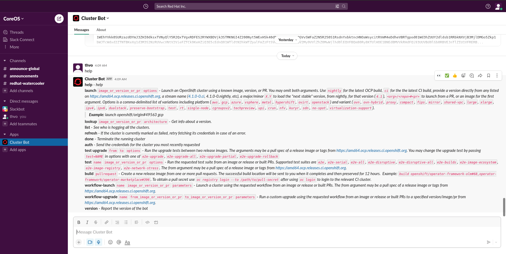
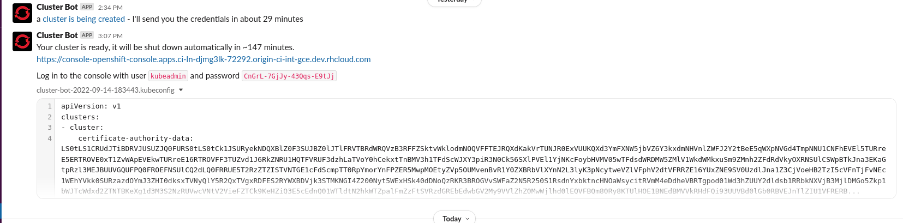
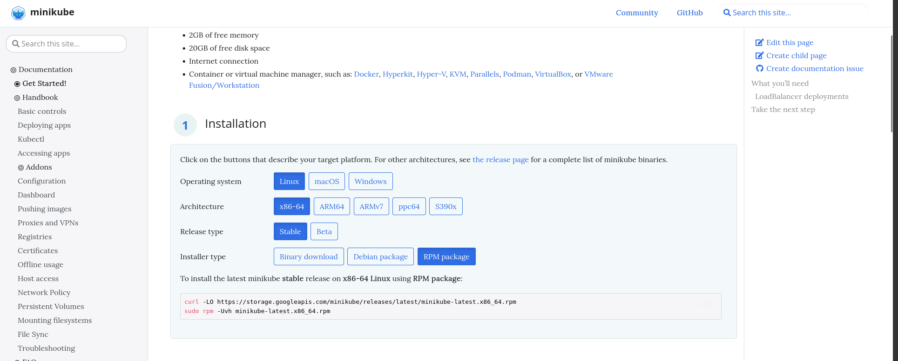

# Accessing a cluster

There are many choices of accessing a cluster for local development and tests. Here are just a few.

**Tips:**

- Configurations for cluster client `kubectl`/`oc` is automatically set in `$HOME/.kube/kubeconfig`. If not (i.e. Cluster Bot), most of the time, you can download config file and set:

    ```bash
    $ export KUBECONFIG=/path/to/config/file
    ```

## Openshift

### CodeReady Container (CRC)

#### Prerequisites

Minimum hardware requirements to run crc instance ([reference](https://crc.dev/crc/#minimum-system-requirements-hardware_gsg)):
- 4 physical CPU cores
- 9 GB of free memory
- 35 GB of storage space

**Note**: Some workload might require more resources, for examples, enabling cluster monitoring.

#### Dependencies

CRC requires the `libvirt` and `NetworkManager` packages to run on Linux. On Fedora, you will likely need to:
```bash
$ sudo dnf install NetworkManager
```

#### Setup/Start CodeReady Container

Downloaded `crc` binary from [Openshift console](https://console.redhat.com/openshift/create/local) (**recommended**) or build from [source](https://github.com/code-ready/crc). Once downloaded/built, add it to `PATH`:

```bash
$ sudo install -o root -g root -m 0755 /path/to/crc /usr/local/bin/crc # This add crc to /usr/local/bin
```

Set up environment:

```bash
$ crc setup
```

Start a cluster instance:

```bash
$ crc start # Defauly 9GB of memory allocated
```

**Note**: To enable cluster monitoring, run (before starting or after stopping instance):

```bash
$ crc config set enable-cluster-monitoring true
```

Then, start the instance again. Mostly likely, you will need to run `crc` with more RAM (default 9GB).

```bash
$ crc start -m 14336 # 14GiB (recommended for core functionality)
```

To stop your cluster instance:

```bash
$ crc stop # All resources will still be on disk the next time crc is started, unless crc delete is run
```

To delete your cluster instance:
```bash
$ crc delete # Delete the crc instance and all states will be lost
```

To enter OpenShift console:
```bash
$ crc console
Opening the OpenShift Web Console in the default browser...
# Your browser will open up...
```

If you forget your credentials, run:
```bash
$ crc console --credentials
To login as a regular user, run 'oc login -u developer -p developer https://api.crc.testing:6443'.
To login as an admin, run 'oc login -u kubeadmin -p SOME_RANDOM_PASSWORD https://api.crc.testing:6443'
# Login as an admin on the web UI with your specific credentials, or login with your terminal
```
	
### Cluster Bot

Cluster Bot behaviour and performance is closer to production clusters. 

You will need access to CoreOS Slack workspace. Once logged in, `Cluster Bot` App needs to be added via `Add apps` tab.

Once installed, you can message "help" to the `Cluster Bot` as followed:



This should the list command that you can specify to launch your cluster.

To look up a specific OpenShift version:

```
lookup 4.11.1
```

To lauch a cluster of a specific version:

```
launch 4.11.1
```

The average waiting time is **29 minutes**. After finishing, it will return the kubeadmin credentials and kubeconfig file:



To terminate the running cluster:
```
done
```

If you forget your `kubeadmin` credentials:
```
auth
```
### Quick Lab (TODO)

## Kubernetes

### Minikube

#### Prerequisites

Minimum hardware requirements to run Minikube ([reference](https://minikube.sigs.k8s.io/docs/start/#what-youll-need)):

- 2 CPUs or more
- 2GB of free memory
- 20GB of free disk space
- Internet connection
- Container Tool: podman/docker

Virtualization must be supported. To check, run the following command and verify that the output is non-empty:

```bash
$ grep -E --color 'vmx|svm' /proc/cpuinfo
```

#### Setup/Start Minikube

Follow [minikube website](https://minikube.sigs.k8s.io/docs/start/#what-youll-need) to select approriate environment for Minikube binary.



Choose your preferred installation method and install `minikube`, verify installation with:

```bash
$ minikube version
minikube version: v1.26.0
commit: f4b412861bb746be73053c9f6d2895f12cf78565
```

Start a new cluster (recommended driver is `kvm2`):
```bash
$ minikube start --driver=kvm2
```

Increase the default memory limit (requires a restart):
```bash
$ minikube config set memory 16384
```

Browse the catalog of easily installed Kubernetes services (i.e Ingress, metrics-server):
```bash
$ minikube addons list
```

To stop your cluster:
```bash
$ minikube stop
```

To clean up local state (i.e. when `minikube start` returns an error):

```bash
$ minikube delete [-all]
```

### Kind

Kind is a tool for running local Kubernetes clusters using Docker container “nodes”.

**Tips**:
- Kind is used as the cluster for OperatorHub testsuite. To run test suite, install `kind v0.11.0` to `/usr/local/bin`.

#### Prerequisites

Kind requires [Docker](https://docs.docker.com/get-docker/) to be installed. There are 2 ways:

- Docker way: Follow Docker official installation [docs](https://docs.docker.com/desktop/install/fedora/).
- Fedora way: Follow this Fedora Magazine [blog](https://fedoramagazine.org/docker-and-fedora-35/) for installing `moby-engine`.

You need to yourself to `docker` group to avoid `sudo` issue when running `kind` in non-root environment.

```bash
$ sudo groupadd docker
$ sudo usermod -aG docker $USER
```

#### Setup/Start Kind

Install with Golang (Recommended `go >= 1.16`):
- `go >= 1.17`: `go install sigs.k8s.io/kind@v0.15.0`
- For older versions use `GO111MODULE="on" go get sigs.k8s.io/kind@v0.15.0`.

With release binaries:
```bash
$ curl -Lo ./kind https://kind.sigs.k8s.io/dl/v0.15.0/kind-linux-amd64
$ chmod +x ./kind
$ sudo mv ./kind /usr/local/bin/kind
```

Create a cluster (specify custom node image with `--image` or name with `--name`):
```bash
$ kind create cluster [--name] [--image] # Default node image: kindest/node and default name: kind
```

Get a list of clusters:
```bash
kind get clusters
```

Delete a cluster:
```bash
kind delete cluster [--name] # Default to kind
```
Cautions: 
> Requesting to delete a cluster that does not exist will not return an error